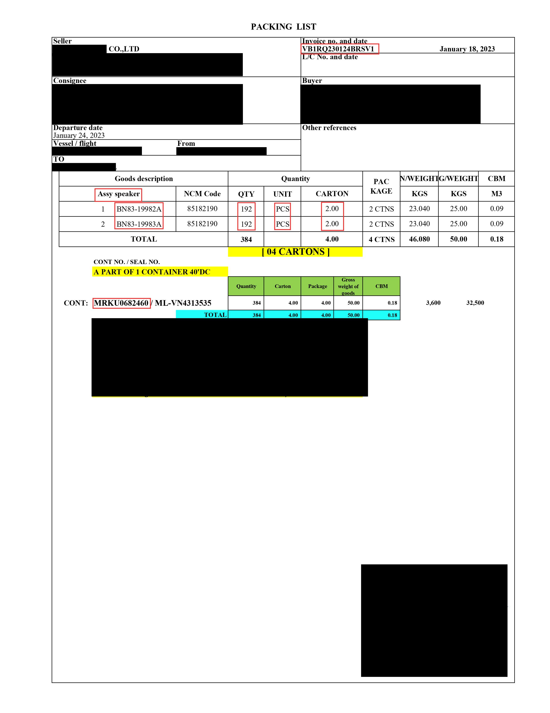
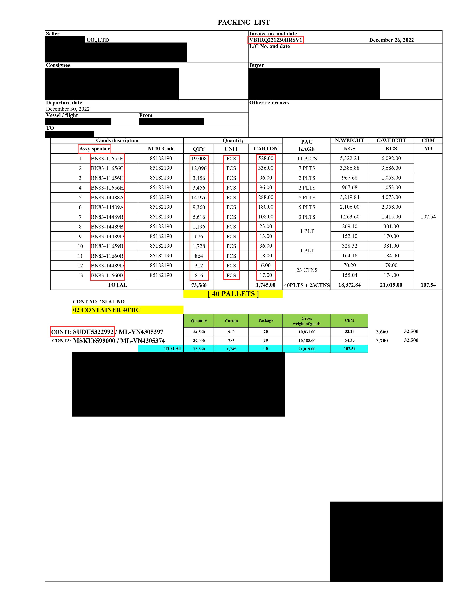

# PDF Extractor

[](https://opensource.org/licenses/MIT)

This project is designed to extract key information from searchable PDF files using Python. It includes two main features: table extraction and prefix extraction. 
<details>
  <summary>See it in action</summary>
    <p align="center">
      <em>PDF files examples. The extracted information is marked in red boxes.</em>
      <br>
      
      
    </p>
  <div style="overflow-x:auto;">
    <table border="1" class="dataframe">
      <thead>
        <tr style="text-align: right;">
          <th>Sample1</th>
          <th>item_code</th>
          <th>item_name</th>
          <th>po_no</th>
          <th>uld_no</th>
          <th>package</th>
          <th>qty_qty</th>
          <th>qty_unit</th>
        </tr>
      </thead>
      <tbody>
        <tr>
          <td>0</td>
          <td>BN83-19982A</td>
          <td>Assy speaker</td>
          <td>VB1RQ230124BRSV1</td>
          <td>MRKU0682460</td>
          <td>2.0</td>
          <td>192</td>
          <td>PCS</td>
        </tr>
        <tr>
          <td>1</td>
          <td>BN83-19983A</td>
          <td>Assy speaker</td>
          <td>VB1RQ230124BRSV1</td>
          <td>MRKU0682460</td>
          <td>2.0</td>
          <td>192</td>
          <td>PCS</td>
        </tr>
      </tbody>
    </table>
  </div>

  <div style="overflow-x:auto;">
    <table border="1" class="dataframe">
      <thead>
        <tr style="text-align: right;">
          <th>Sample2</th>
          <th>item_code</th>
          <th>item_name</th>
          <th>po_no</th>
          <th>uld_no</th>
          <th>package</th>
          <th>qty_qty</th>
          <th>qty_unit</th>
        </tr>
      </thead>
      <tbody>
        <tr>
          <td>0</td>
          <td>BN83-11655E</td>
          <td>Assy speaker</td>
          <td>VB1RQ221230BRSV1</td>
          <td>CONT2:MSKU6599000</td>
          <td>528.0</td>
          <td>19,008</td>
          <td>PCS</td>
        </tr>
        <tr>
          <td>1</td>
          <td>BN83-11656G</td>
          <td>Assy speaker</td>
          <td>VB1RQ221230BRSV1</td>
          <td>CONT2:MSKU6599000</td>
          <td>336.0</td>
          <td>12,096</td>
          <td>PCS</td>
        </tr>
        <tr>
          <td>2</td>
          <td>BN83-11656H</td>
          <td>Assy speaker</td>
          <td>VB1RQ221230BRSV1</td>
          <td>CONT2:MSKU6599000</td>
          <td>96.0</td>
          <td>3,456</td>
          <td>PCS</td>
        </tr>
        <tr>
          <td>3</td>
          <td>BN83-11656H</td>
          <td>Assy speaker</td>
          <td>VB1RQ221230BRSV1</td>
          <td>CONT2:MSKU6599000</td>
          <td>96.0</td>
          <td>3,456</td>
          <td>PCS</td>
        </tr>
        <tr>
          <td>4</td>
          <td>BN83-14488A</td>
          <td>Assy speaker</td>
          <td>VB1RQ221230BRSV1</td>
          <td>CONT2:MSKU6599000</td>
          <td>288.0</td>
          <td>14,976</td>
          <td>PCS</td>
        </tr>
        <tr>
          <td>5</td>
          <td>BN83-14489A</td>
          <td>Assy speaker</td>
          <td>VB1RQ221230BRSV1</td>
          <td>CONT2:MSKU6599000</td>
          <td>180.0</td>
          <td>9,360</td>
          <td>PCS</td>
        </tr>
        <tr>
          <td>6</td>
          <td>BN83-14489B</td>
          <td>Assy speaker</td>
          <td>VB1RQ221230BRSV1</td>
          <td>CONT2:MSKU6599000</td>
          <td>108.0</td>
          <td>5,616</td>
          <td>PCS</td>
        </tr>
        <tr>
          <td>7</td>
          <td>BN83-14489B</td>
          <td>Assy speaker</td>
          <td>VB1RQ221230BRSV1</td>
          <td>CONT2:MSKU6599000</td>
          <td>23.0</td>
          <td>1,196</td>
          <td>PCS</td>
        </tr>
        <tr>
          <td>8</td>
          <td>BN83-14489D</td>
          <td>Assy speaker</td>
          <td>VB1RQ221230BRSV1</td>
          <td>CONT2:MSKU6599000</td>
          <td>13.0</td>
          <td>676</td>
          <td>PCS</td>
        </tr>
        <tr>
          <td>9</td>
          <td>BN83-11659B</td>
          <td>Assy speaker</td>
          <td>VB1RQ221230BRSV1</td>
          <td>CONT2:MSKU6599000</td>
          <td>36.0</td>
          <td>1,728</td>
          <td>PCS</td>
        </tr>
        <tr>
          <td>10</td>
          <td>BN83-11660B</td>
          <td>Assy speaker</td>
          <td>VB1RQ221230BRSV1</td>
          <td>CONT2:MSKU6599000</td>
          <td>18.0</td>
          <td>864</td>
          <td>PCS</td>
        </tr>
        <tr>
          <td>11</td>
          <td>BN83-14489D</td>
          <td>Assy speaker</td>
          <td>VB1RQ221230BRSV1</td>
          <td>CONT2:MSKU6599000</td>
          <td>6.0</td>
          <td>312</td>
          <td>PCS</td>
        </tr>
        <tr>
          <td>12</td>
          <td>BN83-11660B</td>
          <td>Assy speaker</td>
          <td>VB1RQ221230BRSV1</td>
          <td>CONT2:MSKU6599000</td>
          <td>17.0</td>
          <td>816</td>
          <td>PCS</td>
        </tr>
      </tbody>
    </table>
  </div>
</details>


## Table of Contents

  - [Installation](#installation)
  - [Usage](#usage)
  - [Features](#features)
  - [Contributing](#contributing)
  - [License](#license)

## Installation

To use this project, you need to install the following:

- Python 3.9 or higher
- pip

After installing Python and pip, clone this repository and install the required packages by running the following command:

```sh
pip install -r requirements.txt
```

## Usage
To extract key information from a searchable PDF file, run the following command:

```sh
python src/extract.py <path_to_pdf_file>
```
## Features
This project includes two main features:

- Table extraction: Extracts key information from tables from the PDF file by the column index. The extracted column can be configured via TableConfig class, which takes the following parameters:
  
  + tab_id: The index of the table in the page. Set to 0 by default (the first table)
  + col_id: The index of the extracted column
  + col_l2r: if False, the index of col_id will count from right to left
  + top_prefix: A fixed string value to identify where should the table begin
  + top_offset: The distance from the top_prefix to the table (in row unit)
  + bottom_prefix: A fixed string value to identify where should the table end
  + bottom_offset: The distance from the bottom_prefix to the table (in row unit)


- Prefix extraction: Extracts key information by prefixes (fixed string) from the PDF file. The extracted value can be configured via PrefixConfig class, which takes the following parameters:

  + before_prefix: The prefix place before the extracted value. If both before_prefix and after_prefix are used, the extractor will return any matched value of either.
  + before_offset: The distane from the before_prefix to the extracted value (in word unit)
  + after_prefix: The prefix place after the extracted value. If both before_prefix and after_prefix are used, the extractor will return any matched value of either.
  + after_offset: The distane from the after_prefix to the extracted value (in word unit). 
  + n_words: The number of words of the extracted information 
  + is_regex: Whether to match the prefix(es) by regex


## Contributing
Contributions to this project are welcome. To contribute, follow these steps:

- Fork this repository
- Create a new branch (git checkout -b feature/my-new-feature)
- Make changes and commit (git commit -am 'Add some feature')
- Push to the branch (git push origin feature/my-new-feature)
- Create a new pull request

## License
This project is licensed under the terms of the MIT license. See [LICENSE](LICENSE) for more information.